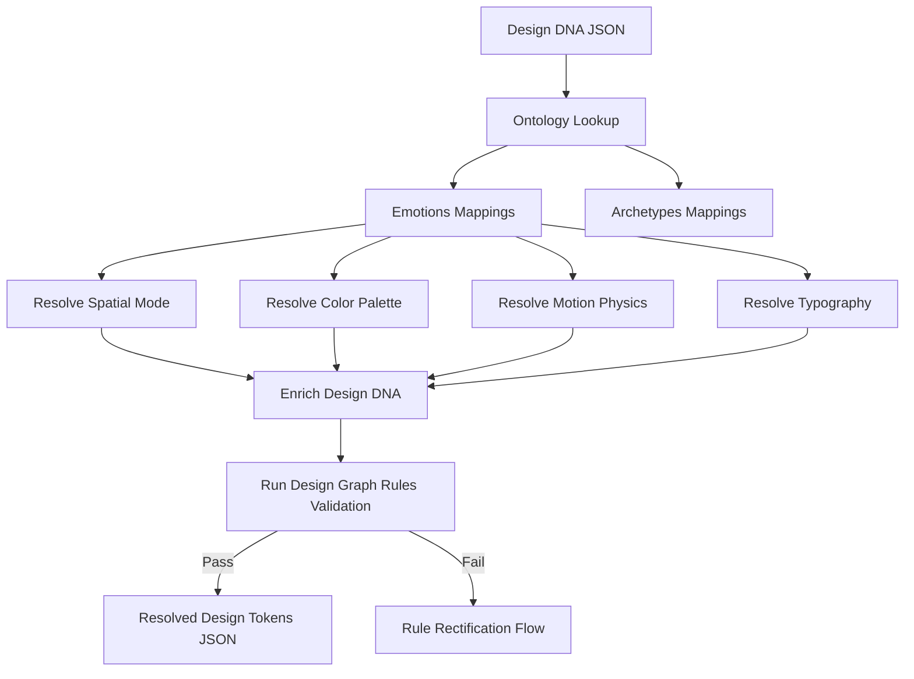

# Directive: Design Ontology Resolution & Critique

## 1. Objective
Guide the orchestrator and the Critic sub-agent on how to enrich a raw `Design DNA` object into complete, concrete design tokens (color hexes, typography families, motion physics, and layout padding). Enforce structural aesthetic rules using the `data/graph/design_rules.json` constraint graph.

---

## 2. Enrichment & Mapping Workflow

### 2.1 Mappings Matrix

#### 2.1.1 Spatial Mappings
* `luxury` | `calm` | `avant-garde` -> Map to `airy` or `immersive` layout mode.
* `trustworthy` | `editorial` -> Map to `grid-heavy` or `asymmetric` layout mode.
* `playful` -> Map to `modular` card layout mode.
* `cyberpunk` | `aggressive` -> Map to `dense` layout mode.

#### 2.1.2 Typography pairings
* `luxury` | `editorial` -> Pair Playfair Display + Inter (`editorial-serif`).
* `calm` -> Pair Outfit + Plus Jakarta Sans (`thin-sans`).
* `trustworthy` -> Pair Sora + Inter (`geometric-sans`).
* `cyberpunk` | `aggressive` -> Pair Space Grotesk + Space Mono (`brutalist-mono`).
* `playful` -> Pair Fredoka One + Quicksand (`rounded-sans`).
* `avant-garde` -> Pair Cinzel Decorative + DM Sans (`funky-serif`).

---

## 3. Design Graph Rules Enforcement

All final resolutions must pass the constraint rules defined in `data/graph/design_rules.json`.

### 3.1 Severity Levels
* **ERROR**: Execution fails immediately. The orchestrator must adjust the layout options (e.g., forcing a high density luxury layout to `low` density).
* **WARNING**: Log the anomaly and proceed, but add a warning tag in the generation metadata (e.g., calming brand using a moderately energetic animation style).

### 3.2 Key Rules
1. **Density Conflict**: A luxury aesthetic cannot exist with `high` density spacing.
2. **Motion Conflict**: A calm aesthetic must keep motion energy under `4`.
3. **Color-Typo Consistency**: A corporate blue palette should not be combined with brutalist mechanical monospace typography.

---

## 4. ASLA YAPMA (Negative Constraints)
- **ASLA duygusal arketiple çelişen ontoloji eşleşmelerine izin verme.** Örneğin sakin (`calm`) bir duygu için sert, mekanik monospace yazı tipleri veya aşırı titreşimli kırmızı/neon renkler atama.
- **ASLA lüks ve minimal temaları yüksek yerleşim yoğunluğu (`high density`) ile eşleme.** Boşluk (whitespace) lüks hissinin ana kaynağıdır.
- **ASLA birbirini ezmeyen, kontrast oluşturmayan font ikilileri türetme.** Başlık fontu ile gövde fontunun karakterleri (örneğin serif ile geometric sans) her zaman estetik olarak birbirini dengelemelidir.
- **ASLA tasarım kuralları grafiğindeki (`design_rules.json`) hataları sessizce yutma.** Bir hata (`ERROR`) oluştuğunda sistemi doğrudan revizyon döngüsüne alarak parametreleri düzeltmeye zorla.
- **ASLA jenerik ve sıkıcı mavi/gri renk kombinasyonlarını varsayılan olarak atama.** Her temanın kendine özgü, premium ve HSL bazlı bir renk harmonisi olmalıdır.
