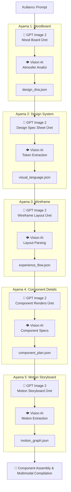

# SOP: Vision-First Multi-Stage Creative Pipeline

Bu döküman, ANDIP (AI-Native Design Intelligence Platform) mimarisi içindeki **Vision-First (Önce-Görsel) Pipeline**'ının standart çalışma yönergelerini (SOP) ve kurallarını tanımlar.

---

## 1. Mimari Genel Bakış

Geleneksel text-to-text akışların (prompt → LLM → JSON → template) aksine, Vision-First Pipeline her aşamada gerçek estetik görseller üretilmesini ve bu görsellerin Vision AI ile analiz edilerek bir sonraki aşamaya yapısal veri olarak beslenmesini sağlar.



---

## 2. Pipeline Kuralları ve Prensipleri

### Rule 1: En Yüksek Görsel Kalite (Resolution & Quality)
Tüm görsel üretimler (`gpt-5.4-image-2`), projenin estetik bütünlüğünü korumak adına her zaman en yüksek kalite parametreleriyle çalıştırılmalıdır. Üretilen görsellerde:
- `High resolution, pristine quality, photorealistic or high-fidelity UI vector style` gibi kalite belirteçleri promptlara otomatik olarak eklenir.
- Lorem Ipsum veya anlamsız metin blokları üretilmemesi için net negatif prompt yönlendirmeleri kullanılır.

### Rule 2: Benzersiz Tasarım (No Cache Policy)
Görsel üretim süreçlerinde **cache kullanılmaz**. Her bir pipeline tetiklenmesi, kullanıcı promptuna özel olarak sıfırdan tamamen benzersiz, kreatif ve sanatsal görsel varlıklar (assets) üretmelidir.

### Rule 3: Hata Durumunda Kesin Durdurma (Strict Failure)
Herhangi bir görsel üretim (Image Gen API) veya Vision Analizi (Vision AI API) başarısız olduğunda veya geçersiz JSON döndürdüğünde, sistem **sessizce eski text-only akışa DÜŞMEMELİDİR**.
- Kullanıcıya hatanın gerçekleştiği aşama ve detayları net olarak gösterilmeli ve işlem derhal sonlandırılmalıdır.
- Bu kural, kaliteden ödün verilmemesini ve hataların anında tespit edilmesini garantiler.

---

## 3. Aşama Spesifikasyonları & Yönergeler

### Aşama 1: Mood Board (Marka DNA'sı)
*   **Amaç:** Kullanıcının soyut veya somut fikirlerini temsil eden kreatif bir panayır (moodboard) oluşturmak.
*   **Prompt Stratejisi:** Atmosferik fotoğraf örnekleri, renk armoni blokları, tipografi dokuları ve derinlik detayları içeren premium grid yerleşimi.
*   **Vision Analizi:** Moodboard'un renk hekslerini (`#hex`), baskın duygusunu (`emotion`), tipografik kontrast seviyesini ve marka arketipini yapısal JSON formatında çıkarmak.

### Aşama 2: Design Specs (Stil Kılavuzu)
*   **Amaç:** Marka DNA'sına göre buton durumları, form elemanları, gölge kademeleri ve tam renk paletini içeren teknik bir stil belgesi çizmek.
*   **Prompt Stratejisi:** Temiz teknik şema çizimi, hex kodlarının yanlarında yazılı olduğu renk kutuları, H1-Body arası font ölçeği örnekleri.
*   **Vision Analizi:** CSS değişkenlerini (`--color-bg`, `--font-header`, vb.), border-radius, gölge değerleri ve spacing birimlerini parse ederek `visual_language.json` oluşturmak.

### Aşama 3: Wireframe (Düzen Şeması)
*   **Amaç:** Landing sayfasının genel yerleşim düzenini, bento grid, asimetrik grid veya minimal bölünmüş ekran yapısını belirlemek.
*   **Prompt Stratejisi:** 12 sütunlu grid yapısı rehberleri içeren temiz teknik wireframe yerleşimi.
*   **Vision Analizi:** Sayfa bölümlerini, görsel ağırlıklarını (`1-10`), hizalama tercihlerini ve yerleşim modellerini belirlemek.

### Aşama 4: Component Details (Bileşen Görselleri)
*   **Amaç:** AI Compiler'ın tam olarak ne üreteceğini görmesi için kritik bir bileşenin (örneğin Hero veya Bento vitrini) yüksek kaliteli görsel render'ını oluşturmak.
*   **Prompt Stratejisi:** Glassmorphism, premium karanlık mod veya skeuomorphic detaylar içeren 4K çözünürlükte gerçekçi arayüz tasarımı render'ı.
*   **Vision Analizi:** Bileşenin padding, gap, hover/focus durum geçişleri ve mikromotor detaylarını yapılandırmak.
*   *Multimodal compiler:* Buradan elde edilen `.png` görsel dosyası, Next.js JSX kodunu yazan AI Compiler'a görsel referans (`vision_ref`) olarak iletilir. AI Compiler, görsele bakarak CSS ve yapıyı aynen kodlar.

### Aşama 5: Motion Storyboard (Etkileşim Fiziği)
*   **Amaç:** Sayfa kaydırma reveals, paralaks derinlikleri ve etkileşim geçişlerini sequential karelerle ve easing grafik çizimiyle göstermek.
*   **Prompt Stratejisi:** sequential keyframe panelleri, hareket yön okları ve cubic-bezier ivmelenme eğrisi grafiği.
*   **Vision Analizi:** İlgili cubic-bezier easing curve değerini (`cubic-bezier(0.16, 1, 0.3, 1)`), animasyon sürelerini (`duration`) ve fizik parametrelerini çıkarmak.

---

## 4. Dosya ve Dizin Yapısı

Bir pipeline çalışması tamamlandıktan sonra session dizin yapısı aşağıdaki gibi olmalıdır:

```text
.tmp/pipeline/{session_id}/
├── visuals/                          # Tüm üretilen PNG görselleri
│   ├── stage_1_moodboard.png         # Marka hissi görseli
│   ├── stage_2_design_spec.png       # Tasarım token'ları görseli
│   ├── stage_3_wireframe.png         # Düzen wireframe görseli
│   ├── stage_4_hero-01_component.png # Kritik bileşen render'ı
│   └── stage_5_motion_storyboard.png # Animasyon blueprint'i görseli
├── step_1_discovery.json             # Vision-First Enriched DNA
├── step_2_brand_strategy.json        # Marka Kimliği
├── step_3_art_direction.json         # Vision-First Enriched Stil kılavuzu
├── step_4_ux_architecture.json       # Vision-First Enriched UX Akışı
├── step_5_motion_direction.json      # Vision-First Enriched Animasyon Grafiği
├── step_6_frontend_arch.json         # Vision-First Enriched Bileşen Planı
├── step_7_critic.json                # Kalite Kontrol Raporu
└── experience_blueprint.json         # Kombine Final Master Blueprint
```

---

## 5. Doğrulama ve Test Yönergeleri

Pipeline geliştirmeleri veya değişiklikleri sonrasında aşağıdaki testler çalıştırılmalıdır:
1.  **Orkestrasyon Testi:** `python execution/test_vision_pipeline_e2e.py`
    *   Tüm 5 görselin başarıyla üretildiğini ve PNG formatında diske yazıldığını,
    *   Tüm 7 JSON dosyasının oluşturulduğunu ve veri şemalarının doğrulandığını,
    *   AI Compiler'ın görsel referansa bakarak Next.js kodunu hatasız derlediğini doğrular.
2.  **Geriye Dönük Uyumluluk Testi:** `python execution/pipeline_runner.py --no-vision`
    *   Eski text-only akışın da hala 100% sorunsuz çalıştığını garanti altına alır.
